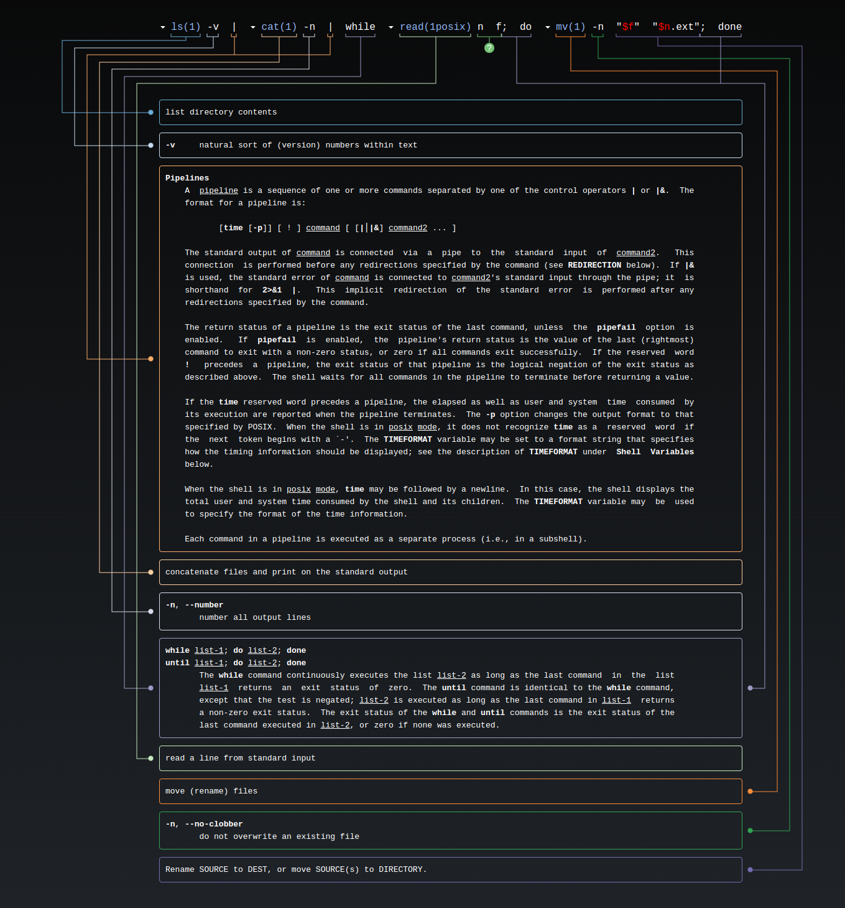

This repo has bunch tools/command etc to get me started in many things. 

### System issues (Somthing that I learned the hard way)
#### Deleted phython and now the ubunutu desktop is broken
-- Go into ubuntu recovery mode: keep shift key untill you enter Grub menu during system boot. Then go to root shell which most likely is password protected so you gotta figure that you. 
-- Then see if network is; ping google. Most likely network is not running so we need to get that started. 
--  In the root shell type: ```ifconfig <interface> up```, here interface name is the ethernet port name. You can do wifi too if you have one. Then, ```dhclient <interface>```
This should get you an ip and if you do ```apt-get install ubuntu-desktop```, most likely it will fix the damage done due to python purging.

### VIM setup

- git clone --depth=1 https://github.com/amix/vimrc.git ~/.vim_runtime
- sh ~/.vim_runtime/install_awesome_vimrc.sh
- vim ~/.vimrc
- insert ```set number``` and ```set relativenumbe```

### Frequently used scripts
- ```note.sh``` this one opens this note book and  let me edit this folder from anywhere in my workstation. These type of scripts are located in my $PATH and have exec permission. 

 
### Store git credentials permanently 
- Do ```git config --global credential.helper store```
- ```git clone``` or ```git pull``` any repo. This will add user name and password in ~/.gitcredential file


### Shell commands

- nautilus . to open terminal in the current folder
 
 ####  clipboard copy from commadn line 
 
 - ```sudo apt-get install xsel```
 - pwd | xsel -b 
 - xsel -b
 - Hex to ASCII: echo -e "\x69"  or echo -e "\x69\x65"  [:confused: figure out why i need \x seperately. Will do it in the future.]   
- Renaming all the files in a directory with sequential ordering. '''ls -v | cat -n | while read n f; do mv -n "$f" "$n.ext"; done'''

- Searching through a linux man: ``` man g++ | grep   -e  "-std"``` this will give you the lines with -std matched. -e is to let the grep know that "-x" or whatever is not an option, it in fact a pattern you are looking for.


 ### Tar commands

- list files in tar archive ```tar -tr <filename.tar.gz>```
- untar  ```tar -xf <filename.tar.gz>``` you want to extract it in another folder that is not you current folder use  ```tar -xf <filename.tar.gz> -C <directoy to export files to>``` 
- tar a file ```tar -cf <archive name.tar.gz>  <list of files you want to archive>```


### SSH

- sudo apt install openssh-server
- sudo systemctl status ssh
- list ssh keys in you local computer: ```ls -al ~/.ssh/id_*.pub```
- Transfer the key to remote machine:  ```ssh-copy-id user@ip-address```. from now on you will not need password to log into the ```ip``` system.
- ```ssh-add ~/.ssh/id_<> ``` add key to the ssh-agent


### Zsh

- sudo apt install zsh
- chsh -s $(which zsh)
- sh -c "$(curl -fsSL https://raw.github.com/ohmyzsh/ohmyzsh/master/tools/install.sh)"
- git clone https://github.com/zsh-users/zsh-autosuggestions ${ZSH_CUSTOM:-~/.oh-my-zsh/custom}/plugins/zsh-autosuggestions
- ```vim  ~/.zshrc``` insert plugins=(zsh-autosuggestions) . Source ~/.zshrc

### VIM commands
- search and replace string ```%s/foo/bar/g``` this one changes your part of the string from foo to bar. This is case insesitive
- Copy paste: go to normal mode (Esc) and press V to select entire line or v to select a bunch of chars. y to yank (copy) c to cut. 
- P to paste
- shift +A goes to end of line and becomes in appen mode


### Python
- Plot help 

```python

import matplotlib
font = {'family' : 'sans-serif',
        'weight' : 'bold',
        'size'   : 14}

matplotlib.rc('font', **font)

- Python daily life: 
-I have a string how to convert it into byte string?
- Most complex syntax of python I wrote: a = [preaged[i] if (preaged - postaged)[i] == 0 else  (1- preaged[i]) for i in range(len(preaged))]
- Here this one checks takes the subtraction of (preaged - postaged) then checks if every elemebts if preaged and post aged are the same. if same it replaces with the preaged[i] or it replaces with ~preaged[i]
- string ''746869736973617365637265746b6579' to ascii conversion: bytearray.fromhex('746869736973617365637265746b6579').decode() ---> thisisasecretkey'

# black box arround the plot 

ax.spines['left'].set_visible(True)
ax.spines["left"].set_color("black")
ax2.spines['bottom'].set_visible(True)
ax2.spines["bottom"].set_color("black")

ax2.spines['top'].set_visible(True)
ax2.spines["top"].set_color("black")

ax.spines['top'].set_visible(True)
ax.spines["top"].set_color("black")


ax.spines['bottom'].set_visible(True)
ax.spines["bottom"].set_color("black")
ax2.spines['right'].set_visible(True)
ax2.spines["right"].set_color("black")

# minor axis tick on the left and bottom

ax.yaxis.tick_left()
ax.xaxis.tick_bottom()

plt.savefig("../graph/a_1.pdf", transparent=True)
 ```

 ### Instll opencv in anaconda. 

- ```Open the base terminal from the GUI or anyother way. source anaconda/bin/activate root should do it```
- pip install opencv-python
- pip install opencv-contrib-python
- should work. If it does do a condat forge first

### Alias
- alias lc="colorls"
- alias folder="nautilus"
- alias doc="cd ~/Documents"

### Find PID
- '''pidof firefox''
- pkill -f JLinkExe


### Searching string (grep, awk, sed)


- get a few lines before and after (aka context) ``` grep -C 12 ``` this will print 12 lines before and after the matched. For example, you want L1  cache info of your system: 
```sudo dmidecode | grep -i l1 -C 10```
- grep -r "string to search" ./*
- grep Design filename -> returns lines with 'Design' in the 'filename'

### MSP432 debugging:

- Find the open openocd.cfg 
- Run ```sudo openocd```
- Run arm-none-ebai-gdb
- type target remote:55000 in the gdb prompt
- ```arm-none-eabi-gdb -iex "target remote localhost:55000"``` this will directly connect the dbugger to the target running at 55000 port.

### j-link setup.
- Download the j-link software .deb pakage from the segger website. 
- JLinkGDBServer should start GDB server
- 
### Find usb device such as debugger
- 
- lusb
- lsusb -vd 03eb:2141 | grep iSerial
-
-## Download flash memory in ATM devices. 
- Use '''JFlashLite''' and bin or hex file

### Upgrade python 
- sudo apt-get install libreadline-gplv2-dev libncursesw5-dev libssl-dev libsqlite3-dev tk-dev libgdbm-dev libc6-dev libbz2-dev
- Download the python you want and compilatione

### Searching in commandline

- ```find . -empty | xargs rm  ``` this will delete empty files from the director . (current). Also, be carefull with the idea that xargs converts stdout to arguments rm. 
-  substituition commands : echo $(ls)
- find . -perm 777 this will return the files with rxw permission

### Hamming dist
	def haming_dist(new_key,key):
    '''Find hamming distance between to <int>, <int>'''
    return sum(list(map(lambda x : int(x), list(bin(new_key ^ key)[2:])))) # find the sum of ons.

### hex dumping an imgae file:
I have file named *.img genrated from compilation for rpi3. How do I see what is inside? NO need for now. .list files give you pretty code understadning


### tmux 
- set :set -g mouse on yto enable scrolling

### Copy SSH key to server
- This allows password less entry to the remote machines
- ssh-copy-id -i ~/.ssh/id_rsa.pub jubayer@172.30.0.214   (if you think this is real ip, the you do not know me yet.)

### USB enabling for UART comp such as Putty
- sudo chown $USER /dev/ttyUSB0 && sudo chmod a+rw /dev/ttyUSB0

### setup vim env

- sudo apt-get update && sudo apt-get install -y curl git gnupg htop  jq  pass  pwgen  python3-pip  ripgrep  rsync  shellcheck  tmux   unzip vim-gtk
- I am an idiot and I pressed ctrl+s in vim. How to get out> ctrl+q


- mkdir -p ~/.local/bin && mkdir -p ~/.vim/spell \
  && ln -fs ~/dotfiles/.aliases ~/.aliases \
  && ln -fs ~/dotfiles/.bashrc ~/.bashrc \
  && ln -fs ~/dotfiles/.gemrc ~/.gemrc \
  && ln -fs ~/dotfiles/.gitconfig ~/.gitconfig \
  && ln -fs ~/dotfiles/.profile ~/.profile \
  && ln -fs ~/dotfiles/.tmux.conf ~/.tmux.conf \
  && ln -fs ~/dotfiles/.vimrc ~/.vimrc \
  && ln -fs ~/dotfiles/.vim/spell/en.utf-8.add ~/.vim/spell/en.utf-8.add \
  && ln -fs ~/dotfiles/.local/bin/set-theme ~/.local/bin/set-theme 
-  curl -fLo ~/.vim/autoload/plug.vim --create-dirs \
  https://raw.githubusercontent.com/junegunn/vim-plug/master/plug.vim

 - git clone --depth 1 https://github.com/junegunn/fzf.git ~/.fzf && ~/.fzf/install
 - vim .
:PlugInstall

### Bibliography for website
- https://app.bibguru.com/p/88d86fb2-9169-4a1a-ab1d-8bc07bed5613
### Find which processor is executing the a process in linux
- ps -o pid,psr,comm -p <pid> 

### GDB
- Nice dash board: https://github.com/cyrus-and/gdb-dashboard
### Little endian in ARM
- Instructions (openOcd or dump file) ---------------> little endian (.bin file)
- load command files at the start of the GDB: '''gdb -x command_file_name''' or source command_file_name 

31d071c0						c071d031 [read ledt to write]

#### delete a char from text file 
- tr -d '\n' < text.txt

#### Device harwdare enumerator in Linux 
- sudo dmidecode

### perf
- sudo apt-get install linux-tools-common
- sudo perf_4.9 record -e cpu-clock,faults ./first


### Qemu

- sudo apt-get install qemu-system
- check 'qemu-system-aarch64 -h' 
- Creating virtual machines: 
- 1. ``qemu-img create -f qcow2 ubuntu.qcow2 16G``
``qemu-system-x86_64 \
    -enable-kvm \
    -m 2048 \
    -nic user,model=virtio \
    -drive file=ubuntu.qcow2,media=disk,if=virtio \
    -cdrom name_of_the_distro_image.iso \``

- sudo apt-get install qemu-kvm libvirt-clients libvirt-daemon-system virtinst bridge-utils
- 


### email inbox cleaning
-- Label: inbox is: unread

### x86 MSRs
- MSR are identifiable with a 32-bit number. This value must be in the ECX to read or write a specific MSR; i.e. '''rdmsr''' or '''wrmsr'''. 
- rdmsr loads the value to the EDX:EAX registers or wrmsr writes these registers' values to the ECX register-indexed MSR.
- Architectural MSRs are pre-fixed with "IA32_" 

### x86 system registers

### Shell command enumerator
explainshell.com will change your life if you just copy a complex shell command there. Look the picture:



### VS code shortcut
- ctrl+shift+L will select all occurence of some text.
- Alt+ click will give you another cursor.

#### Volatility installation and troubleshooting

- Error while running vol : ```ModuleNotFoundError: No module named '_lzma'```

### ECE Server access 
- The machine is in USERNAME@ssh.ece.vt.edu
- The user name is case sensitive.

### Vivado does not install and hangs in Ubunutu.

-- Most likely these libraries are the problem: https://support.xilinx.com/s/article/76616?language=en_US


## install VS code in Centos
- sudo vim /etc/yum.repos.d/vscode.repo 
- copy ```
[vscode]
name=Visual Studio Code
baseurl=https://packages.microsoft.com/yumrepos/vscode
enabled=1
gpgcheck=1
gpgkey=https://packages.microsoft.com/keys/microsoft.asc
```

- sudo rpm --import https://packages.microsoft.com/keys/microsoft.asc 
- sudo yum install code 